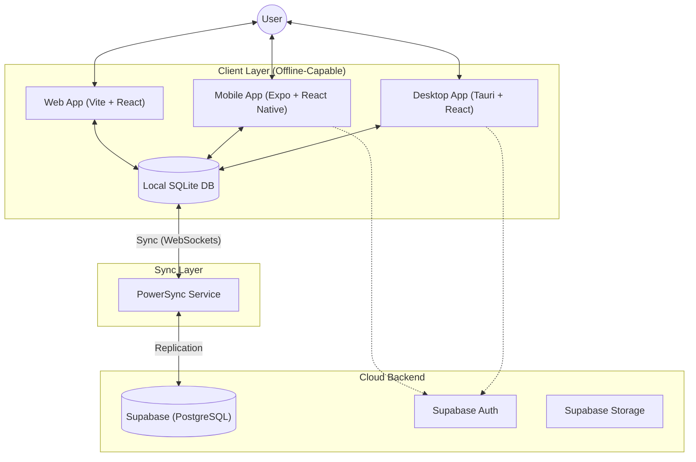

# DigiStoq Monorepo 📦

> **Cross-Platform, Offline-First Inventory & Accounting System** designed for seamless business operations across Desktop, Web, and Mobile.


## 🚀 Executive Summary

**DigiStoq** is a unified monolithic repository ("monorepo") containing a comprehensive suite of applications for inventory management, accounting, and business intelligence. It leverages a **universal app architecture** to share core logic between a **Tauri-based Desktop App**, a **Vite-based Web App**, and an **Expo-based Mobile App**.

The system is architected to be **Offline-First**, ensuring business continuity even without an internet connection, synchronizing data seamlessly when connectivity is restored via **PowerSync**.

### 🎯 Key Capabilities

- **Universal Access:** Work from the office (Desktop) or the field (Mobile) with a unified data experience.
- **Offline Resilience:** Full CRUD capabilities while offline, powered by a local-first SQLite replication engine.
- **Enterprise-Ready Security:** Role-Based Access Control (RBAC), end-to-end encryption in transit, and native process isolation.
- **High Performance:** Virtualized rendering for large datasets (10,000+ items/customers) and optimized Rust-backend for desktop.
- **Multi-Tenant Architecture:** Scalable backend supporting multiple business environments.

---

## 🏗 Deep Architecture

DigiStoq employs a **Local-First, Sync-Second** architecture. Unlike traditional web apps that rely on constant API availability, DigiStoq treats the local SQLite database as the primary source of truth.

### 1. The Data Flow

- **Writes:** User actions (e.g., creating an invoice) are committed immediately to the **Local SQLite DB**.
- **Sync:** The **PowerSync SDK** observes the local WAL (Write Ahead Log) and streams changes to the **Supabase (PostgreSQL)** backend via secure WebSockets.
- **Conflicts:** Conflict resolution follows a "Last Write Wins" strategy at the row level, with specialized business logic for financial ledger consistency.

### 2. Rendering Optimizations

- **Windowing:** Large lists (Invoices/Items) use `@tanstack/react-virtual` to ensure 60fps scrolling even with thousands of records.
- **Master-Detail Layouts:** Optimized for high-productivity desktop usage, allowing simultaneous viewing of lists and record details.
- **Theming:** A custom design system built on **Tailwind CSS v4** featuring a premium "Glassmorphism" aesthetic and full high-contrast dark mode support.



---

## 🛠 Technology Stack

### Universal Frontend (Web & Desktop)

- **Framework**: React 18 with TypeScript
- **Build Tool**: Vite 5
- **State Management**: Zustand
- **Routing**: TanStack Router
- **Styling**: Tailwind CSS (v3.4), clsx, tailwind-merge
- **Forms**: React Hook Form + Zod Validation
- **UI Components**: Lucide Icons, Framer Motion, Recharts
- **PDF Generation**: PDFMake

### Mobile App

- **Framework**: React Native (via Expo SDK 54)
- **Navigation**: React Navigation 7 (Native Stack)
- **Local Database**: `@op-engineering/op-sqlite`
- **Animations**: React Native Reanimated

### Backend & Data Layers

- **Desktop Runtime**: Tauri 2.0 (Rust)
- **Cloud Database**: Supabase (PostgreSQL)
- **Sync Engine**: PowerSync (Offline-first SQLite replication)
- **Authentication**: Supabase Auth

---

## 📦 Directory Structure

```text
monorepo/
├── mobile/                 # React Native Mobile App (Expo)
│   ├── src/
│   │   ├── screens/       # 60+ Application Screens
│   │   ├── components/    # Mobile-native UI components
│   │   └── navigation/    # React Navigation stacks
│   └── package.json
├── src/                    # Shared Web & Desktop Frontend (React)
│   ├── features/          # Business Logic Modules (Sales, Inventory)
│   ├── components/        # Shared UI Components
│   ├── lib/               # Core Utilities (PowerSync, Supabase)
│   └── routes/            # File-based Routing
├── src-tauri/             # Desktop Runtime (Rust)
├── docs/                  # Documentation
├── plan-doc/              # Development Notebooks & Specs
└── package.json           # Root Configuration (Workspaces)
```

---

## 🧩 Business Modules & Features

### 📊 Dashboard & Intelligence

- **Business Snapshot**: Real-time overview of Revenue, Expenses, and Net Profit.
- **Sales Analytics**: Visual trends for sales performance over time.
- **Stock Overview**: Quick view of low stock items and inventory valuation.
- **Cash Flow**: Monitor inflows and outflows at a glance.

### 🛒 Sales & Revenue (Order to Cash)

- **Estimates/Quotes**: Create professional quotations and convert them to invoices with one click.
- **Tax Invoicing**: Generate GST/VAT compliant invoices with customizable series and themes.
- **Credit Notes**: Manage sales returns and issue store credits or refunds.
- **Payment Receipts (Payment In)**: Record payments against multiple invoices with auto-fill capabilities.
- **Delivery Tracking**: Manage transport details, delivery dates, and locations.
- **Recurring Invoices**: (Roadmap) Automate monthly billing.

### 🛍️ Purchases & Operations (Procure to Pay)

- **Purchase Bills**: Track vendor invoices and manage outstanding payables.
- **Expense Tracking**: Record operational expenses (Rent, Utilities, Salary) with category classification.
- **Debit Notes**: Manage purchase returns and supplier credits.
- **Supplier Payments (Payment Out)**: Record payments to vendors against specific purchase bills.

### 📦 Inventory & Stock Control

- **Rich Item Master**: Manage Products (Stockable), Services (Non-stockable), and Assemblies.
- **Batch & Expiry Tracking**: Track items by batch numbers and monitor expiry dates (Pharmaceutical/FMCG ready).
- **Multi-Unit Support**: Manage items in different units (Pcs, Box, Kg) with conversion factors.
- **Inventory Adjustments**: Manual stock corrections and audit logs.
- **MRP & Pricing**: Maintain Maximum Retail Price (MRP), wholesale prices, and dynamic margins.
- **Low Stock Intelligence**: Automated alerts when stock falls below safety levels.

### 👥 Parties & CRM

- **Unified Ledger**: Integrated customer and supplier ledgers with transaction history and real-time balance tracking.
- **Credit Management Engine**:
  - **Dynamic Limits**: Set hard or soft credit limits for customers.
  - **Days-to-Pay Analysis**: Automatically calculate weighted average payment days.
  - **Overdue Locking**: (Roadmap) Prevent further sales to customers with overdue balances beyond a safety threshold.
- **Party Profiling**: Store hierarchical contact details, Tax IDs (GSTIN/NTN), and multiple shipping/billing addresses.
- **Balance Aging**: Multi-bucket aging (0-30, 31-60, 61-90, 90+ days) for effective debt recovery.

### 🔄 Data Integrity & Life Cycle

- **Atomic Transactions**: Sales and Purchase entries are processed as atomic units (Header + Items + Ledger Update) to prevent data corruption.
- **History Logs**: Automated history tracking for state changes (e.g., when an Estimate is converted to an Invoice).
- **Soft Deletion**: (Roadmap) Critical financial data uses soft-deletion to ensure auditability and easier data recovery.

### 💰 Cash, Banking & Loans

- **Multi-Account Banking**: Manage multiple bank accounts and reconcile transactions.
- **Cash Management**: Dedicated petty cash ledger for daily operational expenses.
- **Fund Transfers**: Seamlessly transfer funds between cash and bank accounts.
- **Loan Lifecycle**: Track business loans, repayments, and interest expenses.
- **Cheque Management**: Monitor PDC (Post-Dated Cheques) status from received to cleared.

### 📈 Comprehensive Reporting & BI

- **Financial Intelligence**: Standard Profit & Loss, Balance Sheet, and Trial Balance with drill-down capabilities.
- **Inventory Analytics**: Stock aging, movement history, and valuation (FIFO/Weighted Average).
- **Party 360**: Complete history of every customer/supplier interaction in a unified timeline.
- **Custom Exports**: High-fidelity PDF generation using `pdfmake` with support for business logos and custom headers.

### 🛠️ Advanced Utilities

- **Smart Import Wizard**: Intelligent column mapping for migrating legacy data from Excel/QuickBooks.
- **Bulk Processor**: Update thousands of records (prices, categories, tax rates) in a single operation.
- **Sync Monitor**: Real-time status of the offline-sync engine and connectivity health.
- **Data Cleanup**: Automated tools for removing orphaned records and optimizing local database size.

---

## ⚖️ Business Logic & Compliance

### 1. Tax Calculation Engine

- **Global Compliance**: Supports GST, VAT, and Sales Tax configurations.
- **Inclusive/Exclusive Pricing**: Flexible tax calculation at item and invoice levels.
- **Group Taxes**: Create complex tax structures (e.g., CGST + SGST).

### 2. Inventory Valuation

- **Real-time FIFO**: Automatically tracks stock value based on purchase history.
- **Assembly logic**: Manage "Bill of Materials" (BOM) where selling one item automatically deducts multiple component parts from stock.

### 3. Financial Integrity

- **Double-Entry Simulation**: While simplified for ease of use, the underlying ledger ensures that every Sale/Payment maintains a balanced accounting state.
- **Audit Trails**: Every transaction carries an immutable record of when and by whom it was created.

---

## 💾 Data Model (PowerSync Schema)

The specific PowerSync Schema definitions allow valid local-first data operations.

### Core Tables

| Table              | Description                                              |
| :----------------- | :------------------------------------------------------- |
| `customers`        | Stores Customers and Suppliers with type classification. |
| `items`            | Products and Services inventory.                         |
| `categories`       | Item categories.                                         |
| `company_settings` | Global organization profile.                             |

### Transactions

| Table                | Description                               |
| :------------------- | :---------------------------------------- |
| `sale_invoices`      | Invoice headers (Date, Due Date, Status). |
| `sale_invoice_items` | Line items linked to Invoices.            |
| `purchase_invoices`  | Supplier Bill headers.                    |
| `payment_ins`        | Customer receipts.                        |
| `payment_outs`       | Supplier payments.                        |
| `expenses`           | Direct operational expense records.       |

### Banking & Finance

| Table               | Description                       |
| :------------------ | :-------------------------------- |
| `bank_accounts`     | Ledger for bank accounts.         |
| `bank_transactions` | Deposits, Withdrawals, Transfers. |
| `cash_transactions` | Petty Cash ledger.                |
| `cheques`           | Cheque lifecycle management.      |

> **Note**: Full SQL migrations and Schema definitions are available in `plan-doc/`.

---

## 🖥️ Desktop-Native Advantages (Tauri 2.0)

While DigiStoq is cross-platform, the **Desktop Application** offers unique advantages for high-performance business environments:

- **Isolated Local Database**: Native SQLite integration via Rust for ultra-fast queries and bulk data processing.
- **Strict Security**: Hardened Content Security Policy (CSP) and native process isolation.
- **Window Management**: Optimized desktop layout with multi-window support (roadmap) and keyboard shortcuts.
- **Native Installers**: Distributed via lightweight **NSIS (.exe)** or **MSI** installers for Windows.
- **Low Footprint**: Significantly lower RAM and CPU usage compared to Electron-based applications.
- **Hardware Integration**: (Roadmap) Support for thermal printers, barcode scanners, and peripheral hardware directly via Rust.

---

## 🚦 Getting Started

### Prerequisites

- **Node.js**: v18+
- **Rust**: Latst stable (for Tauri)
- **VS Build Tools**: (Windows only) for C++ compilation.

### Installation

1.  **Clone the Repository**

    ```bash
    git clone https://github.com/DigiStoq/monorepo.git
    cd monorepo
    ```

2.  **Install Dependencies**

    ```bash
    npm install
    # This installs dependencies for root, desktop, and mobile workspaces
    ```

3.  **Environment Setup**
    Create `.env` in the root and `.env` in `mobile/`:
    ```env
    VITE_SUPABASE_URL=your_url
    VITE_POWERSYNC_URL=your_url
    ```

### Running the Apps

- **Desktop (Dev)**: `npm run tauri:dev` (Starts Vite + Tauri Rust backend)
- **Web App (Dev)**: `npm run dev` (Starts standalone web experience)
- **Mobile (Android)**: `npm run mobile:android` (Requires Android Studio/Emulator)
- **Mobile (iOS)**: `npm run mobile:ios` (Requires Xcode/Simulator)
- **Tests**: `npm test` (Runs Vitest suite for core business logic)

---

## 🛠 Developer Guide

### 1. AI-Powered Development

This monorepo uses the **Antigravity Framework** for AI orchestration. The `.agent/` directory contains:

- **Master Agents**: Domain-specific AI configurations (Backend, Frontend, Security).
- **Skills**: Reusable AI-executable protocols (e.g., `clean-code`, `systematic-debugging`).
- **Workflows**: Standardized paths for creating features (`/create`) or debugging UI (`/ui-ux-pro-max`).

### 2. Testing Protocol

- **Unit Tests**: Business logic and hooks (located in `src/__tests__/`).
- **E2E Tests**: Playwright scripts for critical user flows (Login, Invoicing).
- **Contract Tests**: Ensuring Supabase/PowerSync schema alignment.

### 3. Coding Standards (Clean Code)

- **Pragmatic DRY**: Shared logic in `src/features/` shared between Tauri and Web.
- **Type Safety**: 100% TypeScript coverage with strict null checks.
- **Performance**: Zero-unnecessary-renders policy using `useMemo/useCallback` in high-frequency paths.

---

## 🔮 Roadmap & Status

| Phase                      | Status             | Description                                                   |
| :------------------------- | :----------------- | :------------------------------------------------------------ |
| **Phase 1: Core Desktop**  | ✅ **Done**        | Sales, Purchases, Inventory, Reports complete on Desktop/Web. |
| **Phase 2: Sync Engine**   | ✅ **Done**        | High-performance offline sync configuration.                  |
| **Phase 3: Real Data**     | 🚧 **In Progress** | Migrating from mock data to live DB hooks.                    |
| **Phase 4: Mobile Parity** | 🚧 **In Progress** | Porting complex Desktop features to Mobile.                   |

---

## 📄 License

Private / Proprietary.
