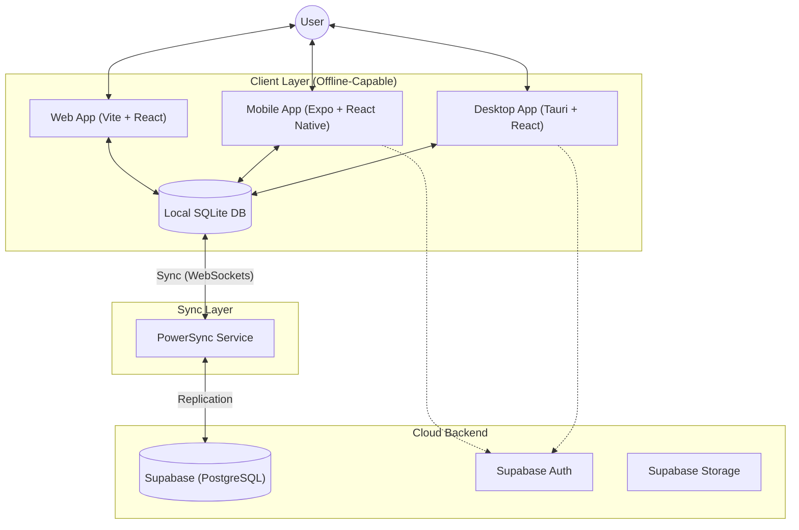

# DigiStoq Monorepo 📦

> **Cross-Platform, Offline-First Inventory & Accounting System** designed for seamless business operations across Desktop, Web, and Mobile.


## 🚀 Executive Summary

**DigiStoq** is a unified monolithic repository ("monorepo") containing a comprehensive suite of applications for inventory management, accounting, and business intelligence. It leverages a **universal app architecture** to share core logic between a **Tauri-based Desktop App**, a **Vite-based Web App**, and an **Expo-based Mobile App**.

The system is architected to be **Offline-First**, ensuring business continuity even without an internet connection, synchronizing data seamlessly when connectivity is restored via **PowerSync**.

### 🎯 Key Capabilities
*   **Universal Access:** Work from the office (Desktop) or the field (Mobile).
*   **Offline Resilience:** Full CRUD capabilities while offline.
*   **Enterprise Grade:** Role-based security, audit trails, and scalable architecture.
*   **Cross-Platform:** Windows, macOS, Linux, iOS, Android, and Web.

---

## 🏗 Architecture

The project follows a modern **Local-First** architecture.



---

## 🛠 Technology Stack

### Universal Frontend (Web & Desktop)
-   **Framework**: React 18 with TypeScript
-   **Build Tool**: Vite 5
-   **State Management**: Zustand
-   **Routing**: TanStack Router
-   **Styling**: Tailwind CSS (v3.4), clsx, tailwind-merge
-   **Forms**: React Hook Form + Zod Validation
-   **UI Components**: Lucide Icons, Framer Motion, Recharts
-   **PDF Generation**: PDFMake

### Mobile App
-   **Framework**: React Native (via Expo SDK 54)
-   **Navigation**: React Navigation 7 (Native Stack)
-   **Local Database**: `@op-engineering/op-sqlite`
-   **Animations**: React Native Reanimated

### Backend & Data Layers
-   **Desktop Runtime**: Tauri 2.0 (Rust)
-   **Cloud Database**: Supabase (PostgreSQL)
-   **Sync Engine**: PowerSync (Offline-first SQLite replication)
-   **Authentication**: Supabase Auth

---

## 📦 Directory Structure

```text
monorepo/
├── mobile/                 # React Native Mobile App (Expo)
│   ├── src/
│   │   ├── screens/       # 60+ Application Screens
│   │   ├── components/    # Mobile-native UI components
│   │   └── navigation/    # React Navigation stacks
│   └── package.json
├── src/                    # Shared Web & Desktop Frontend (React)
│   ├── features/          # Business Logic Modules (Sales, Inventory)
│   ├── components/        # Shared UI Components
│   ├── lib/               # Core Utilities (PowerSync, Supabase)
│   └── routes/            # File-based Routing
├── src-tauri/             # Desktop Runtime (Rust)
├── docs/                  # Documentation
├── plan-doc/              # Development Notebooks & Specs
└── package.json           # Root Configuration (Workspaces)
```

---

## 🧩 Business Modules & Features

### 📊 Dashboard
- Real-time business overview
- Financial KPIs (Revenue, Expenses, Net Profit)
- Sales trends visualization

### 🛒 Sales (Order to Cash)
- **Estimates**: Create and send professional quotes.
- **Invoices**: Convert estimates to invoices seamlessly.
- **Credit Notes**: Manage returns and refunds.
- **Payments In**: Track customer payments (Cash/Bank).

### 🛍️ Purchases (Procure to Pay)
- **Purchase Invoices**: Track supplier bills.
- **Expenses**: Record operational costs (Rent, Utilities).
- **Payments Out**: Manage supplier payments.

### 📦 Inventory Management
- **Item Master**: Products, Services, and Assemblies.
- **Stock Tracking**: Real-time quantity on hand.
- **Low Stock Alerts**: Automated reorder notifications.
- **Profitability Analysis**: Margin calculation per item.

### 👥 Parties (CRM)
- **Customers**: Ledger management, credit limits, aging analysis.
- **Suppliers**: Vendor management, payment history.

### 💰 Cash & Banking
- **Bank Accounts**: Multi-currency account tracking.
- **Cash Hand**: PC (Petty Cash) management.
- **Cheques**: Tracking PDC (Post-Dated Cheques) status.

### 📈 Comprehensive Reporting
- **Financial**: Balance Sheet, Profit & Loss, Cash Flow.
- **Tax**: Tax Summary, GST/VAT Reports.
- **Registers**: Sales/Purchase Registers, Day Book.
- **Inventory**: Stock Summary, Item Movement, Low Stock.

---

## 💾 Data Model (PowerSync Schema)

The specific PowerSync Schema definitions allow valid local-first data operations.

### Core Tables
| Table | Description |
| :--- | :--- |
| `customers` | Stores Customers and Suppliers with type classification. |
| `items` | Products and Services inventory. |
| `categories` | Item categories. |
| `company_settings` | Global organization profile. |

### Transactions
| Table | Description |
| :--- | :--- |
| `sale_invoices` | Invoice headers (Date, Due Date, Status). |
| `sale_invoice_items` | Line items linked to Invoices. |
| `purchase_invoices` | Supplier Bill headers. |
| `payment_ins` | Customer receipts. |
| `payment_outs` | Supplier payments. |
| `expenses` | Direct operational expense records. |

### Banking & Finance
| Table | Description |
| :--- | :--- |
| `bank_accounts` | Ledger for bank accounts. |
| `bank_transactions` | Deposits, Withdrawals, Transfers. |
| `cash_transactions` | Petty Cash ledger. |
| `cheques` | Cheque lifecycle management. |

> **Note**: Full SQL migrations and Schema definitions are available in `plan-doc/`.

---

## 🚦 Getting Started

### Prerequisites
*   **Node.js**: v18+
*   **Rust**: Latst stable (for Tauri)
*   **VS Build Tools**: (Windows only) for C++ compilation.

### Installation

1.  **Clone the Repository**
    ```bash
    git clone https://github.com/DigiStoq/monorepo.git
    cd monorepo
    ```

2.  **Install Dependencies**
    ```bash
    npm install
    # This installs dependencies for root, desktop, and mobile workspaces
    ```

3.  **Environment Setup**
    Create `.env` in the root and `.env` in `mobile/`:
    ```env
    VITE_SUPABASE_URL=your_url
    VITE_POWERSYNC_URL=your_url
    ```

### Running the Apps

*   **Desktop (Dev)**: `npm run tauri:dev`
*   **Mobile (Android)**: `npm run mobile:android`
*   **Mobile (iOS)**: `npm run mobile:ios`

---

## 🔮 Roadmap & Status

| Phase | Status | Description |
| :--- | :--- | :--- |
| **Phase 1: Core Desktop** | ✅ **Done** | Sales, Purchases, Inventory, Reports complete on Desktop/Web. |
| **Phase 2: Sync Engine** | ✅ **Done** | High-performance offline sync configuration. |
| **Phase 3: Real Data** | 🚧 **In Progress** | Migrating from mock data to live DB hooks. |
| **Phase 4: Mobile Parity** | 🚧 **In Progress** | Porting complex Desktop features to Mobile. |

---

## 📄 License
Private / Proprietary.
